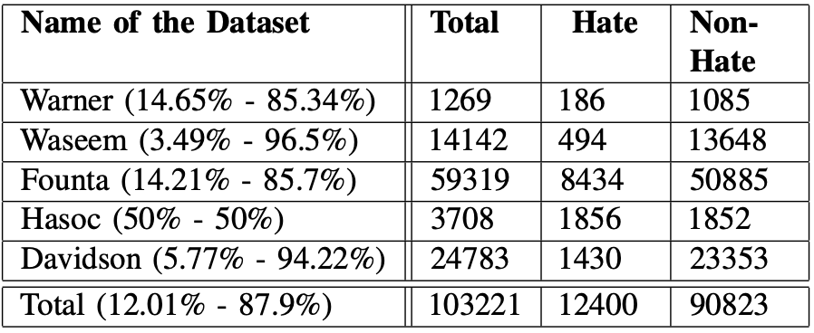
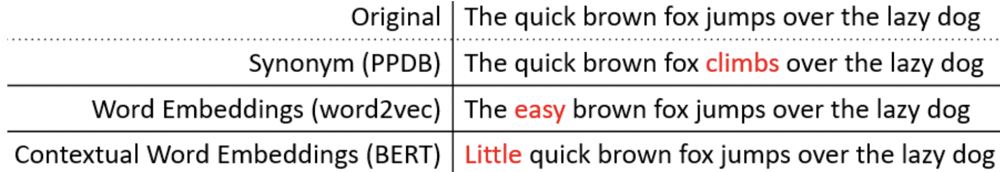
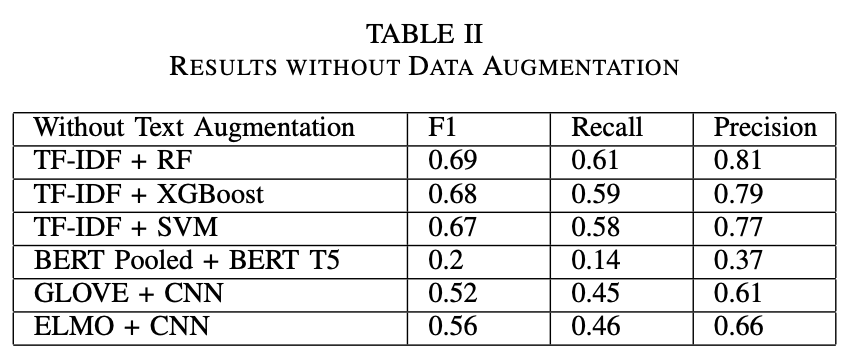
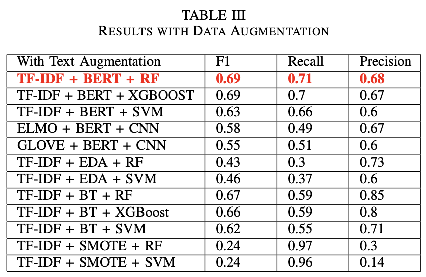

<p align="center">
  <a href="https://github.com/dhyan1999/Hate_Speech_Detection" title="Hate Speech Detection">
  </a>
</p>
<h1 align="center"> A Comparative study of Data-Augmentation Techniques for Imbalanced Hate speech data </h1>


Abstract : <p > Social media and microblogging apps allow people to share their information and express their personal view-points extensively and immediately. However, it also has some negative aspects such as hate speech. Recent advances in Natural Language Processing and Artificial Intelligence allow for more accurate detection of hate speech in textual streams. A significant challenge in this domain is that, while the presence of hate speech can be detrimental to the quality of service provided by social platforms, it still constitutes only a tiny fraction of the content available online, which can lead to performance deterioration due to majority class overfitting. To this end, we propose various data augmentation techniques with the goal of reducing class imbalance and maximizing the amount of information we can extract from our limited resources. After that, we apply them on a selection of top-performing deep architectures and hate speech datasets in order to classify them. The proposed approach outperforms all other considered algorithms. It achieves 0.69 F1-score for hate/non-hate classification</p>

<h2 align="center">🌐 Links 🌐</h2>
<p align="center">
    <a href="https://github.com/dhyan1999/Hate_Speech_Detection" title="Helmet Detection">📂 Repo</a>
    ·
    <a href="https://github.com/dhyan1999/Hate_Speech_Detection/blob/main/Report/Hate_Speech_Detection.pdf" title="Helmet Detection">📄 Paper</a>
    
</p>


## Table of Content

1. [Manifest](#-manifest)
2. [Prerequisites](#-prerequisites)
3. [Data-Set](#data-set)
4. [Implementation of Code](#-implementation-of-code)
5. [Results](#results)
## 🧑🏻‍🏫 Manifest


```
- Code - Contains all parts of code in a sequential manner
- Dataset - Dataset that we have used in our project (Augmented Dataset as well)
- Presentation - Final Presentation
- Report - IEEE Paper for the project
```


## 🤔 Prerequisites

- [Python](https://www.python.org/ "Python") Installed

- Python Basics Understanding

- Understanding of Machine Learning and Deep Learning libraries

- Concepts of Natural Langauge Processing

## Data-Set



## 👨🏻‍💻 Implementation of Code

BERT Contextual Embedding
- We assume an invariance that sentences are natural even if the words in the sentences are replaced with other words with paradigmatic relations.
- At the word places, we stochastically swap out words with others that a bidirectional language model predicts. There are many context-sensitive terms, but they are all acceptable for enhancing the original language



```py
import nlpaug.augmenter.word.context_word_embs as aug
augmenter = aug.ContextualWordEmbsAug(model_path='bert-base-uncased', action="insert")
def augmentMyData(df, augmenter, repetitions=1, samples=200):
    augmented_texts = []
    # select only the minority class samples
    spam_df = df[df['label'] == 1].reset_index(drop=True) # removes unecessary index column
    for i in tqdm(np.random.randint(0, len(spam_df), samples)):
        # generating 'n_samples' augmented texts
        for _ in range(repetitions):
            augmented_text = augmenter.augment(str(spam_df['Text'].iloc[i]))
            augmented_texts.append(augmented_text)
    
    data = {
        'label': 1,
        'Text': augmented_texts
    }
    aug_df = pd.DataFrame(data)
    df = shuffle(df.append(aug_df).reset_index(drop=True))
    return df
```


## Results





The original dataset has only 12.01% of hate speech data. However, We increased the minority class until the threshold point (50%), using Bert contextual embeddings. The Fig.12 represents the graphical representation of the classification report.

<div>
    <a href="https://plotly.com/~dhyan1999/1/" target="_blank" title="Final Bert Augmentation Output" style="display: block; text-align: center;"></a>
</div>

According to our research comparing various model types, word embedding techniques, and augmentation approaches, we have come to the conclusion that augmentation is a critical element of an unbalanced dataset to get a better F1 score. BERT contextual embedding is highly helpful for text augmentation in our scenario since it doesn’t alter the sentence’s main idea; rather, it only adds supporting words. Our tests reveal that the combination of TD-IDF + BERT Contextual Embedding + Random Forest provides the greatest F1-Score, Recall, and accuracy.

## 🧑🏻 Author

**Dhyan Shah**

- 🌌 [Profile](https://github.com/dhyan1999 "Dhyan Shah")

- 🏮 [Email](mailto:dhyan.shah99@gmail.com?subject=Hi%20from%20Dhyan%20Shah "Hi!")

<p align="center">Made with Python & ❤️ in India</p>